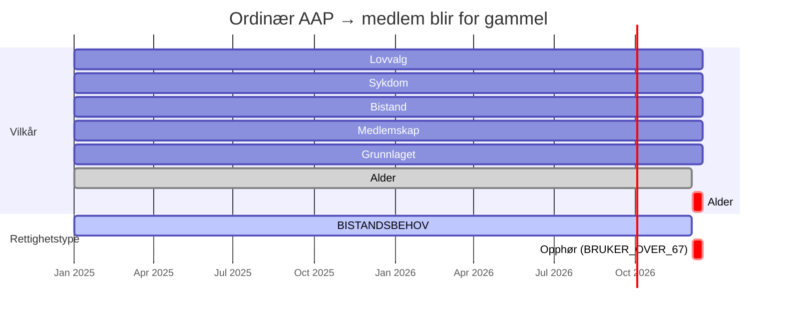
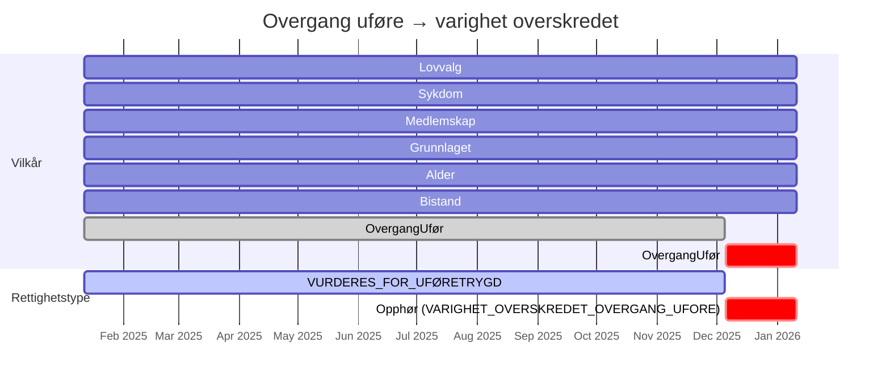
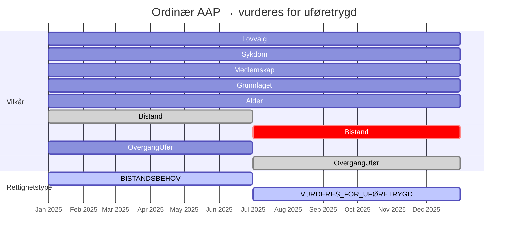

# Module behandlingsflyt

I denne modulen er alle domeneobjekter. Vi unngår å eksponere disse i api-modulen.

# Package no.nav.aap.behandlingsflyt.sakogbehandling.sak

`Sak` representerer en persons rettighetsperiode for AAP. En sak har ett saksnummer, én person og én rettighetsperiode, og fungerer som rot for alle behandlinger.

# Package no.nav.aap.behandlingsflyt.sakogbehandling.behandling

## Relasjon mellom `Sak` og `Behandling`

```
Sak (1) ──────────── (n) Behandling
 │                          │
 ├── id: SakId ◄─────── sakId
 ├── saksnummer
 ├── person
 └── rettighetsperiode
```

En `Sak` kan ha mange `Behandling`er (førstegangsbehandling, revurderinger, klager, aktivitetsplikt, osv.).
`Behandling` peker tilbake på saken via `sakId`, og på forrige behandling via `forrigeBehandlingId` –
slik utgjør behandlingene en singly-linked list over tid.

## Livsløp: oppretting av ny behandling

```
BehandlingService.finnEllerOpprettBehandling(sakId, vurderingsbehovOgÅrsak)
        │
        ├── Ingen tidligere behandling?
        │       └──► opprettFørstegangsbehandling()   (forrigeBehandlingId = null, ingen kopiering)
        │
        ├── Forrige behandling er avsluttet?
        │       └──► opprettRevurdering()             ← kopier() kalles
        │
        ├── Åpen fasttrack-behandling finnes?
        │       └──► opprettRevurderingForranÅpenBehandling()  ← kopier() kalles
        │
        └── Åpen ordinær behandling finnes?
                └──► oppdaterVurderingsbehovOgÅrsak() (ingen ny behandling, ingen kopiering)
```

## Hva skjer når `kopier()` kalles?

Etter at en ny `Behandling` er persistert, kaller `BehandlingService` `GrunnlagKopierer.overfør(fra, til)`.
`GrunnlagKopiererImpl` itererer over **alle** registrerte `Repository`-implementasjoner og kaller
`kopier(fraBehandlingId, tilBehandlingId)` på hver enkelt.

```
BehandlingService
    ├── behandlingRepository.opprettBehandling(...)       ← ny Behandling lagres
    └── grunnlagKopierer.overfør(forrige.id, ny.id)
              └── for each Repository:
                      repository.kopier(fra, til)        ← nye DB-rader med tilBehandlingId
```

Kopiering lager **nye rader** i databasen knyttet til den nye behandlingen –
den gamle behandlingen berøres ikke. Den nye behandlingen starter dermed med et komplett
grunnlag fra forrige, og saksbehandler kan overstyre enkeltfelter uten å påvirke historikken.

Følgende kategorier kopieres:

| Kategori                      | Eksempler                                                                                            |
|-------------------------------|------------------------------------------------------------------------------------------------------|
| Faktagrunnlag (register)      | Inntekt, yrkesskade, uføre, barn, institusjonsopphold, tiltakspenger, dagpenger, opphold, medlemskap |
| Faktagrunnlag (saksbehandler) | Sykdom, bistand, meldeplikt, arbeidsgiver, krav                                                      |
| Delvurderinger                | Vilkårsresultat, samordning, stans/opphør, barnetillegg, underveis                                   |
| Behandlingsdata               | Vedtak, avklaringsbehov, brev, tilkjent ytelse, kontekstlogg                                         |
| Persondata                    | Personopplysninger, PIP-data                                                                         |

## Spesialtilfelle: revurdering foran åpen behandling

Når en fasttrack-hendelse ankommer mens det allerede finnes en åpen revurdering, settes den nye
behandlingen inn mellom den avsluttede forrige og den åpne:

```
[Avsluttet FGB] ◄── [Åpen Revurdering A]

  ↓ ny fasttrack-hendelse

[Avsluttet FGB] ◄── [Ny Revurdering B] ◄── [Åpen Revurdering A]
                          │
                          └── kopier() fra FGB → B
```

Den nye behandlingen (B) må avsluttes atomært i samme transaksjon.
`Revurdering A` sin `forrigeBehandlingId` flyttes til å peke på B.

## Oppsummering – når kopieres det?

| Hendelse                                    | `forrigeBehandlingId`      | `kopier()` kalles? |
|---------------------------------------------|----------------------------|--------------------|
| Ny førstegangsbehandling                    | `null`                     | Nei                |
| Ny revurdering (forrige avsluttet)          | `forrige.id`               | **Ja**             |
| Fasttrack foran åpen revurdering            | `avsluttetFGB.id`          | **Ja**             |
| Aktivitetspliktbehandling                   | `forrige.id` (hvis finnes) | **Ja**             |
| Klage / Oppfølging / SvarFraAndreinstans    | `null`                     | Nei                |
| Oppdatering av eksisterende åpen behandling | —                          | Nei                |

# Package no.nav.aap.behandlingsflyt.behandling.rettighetstype

`vurderRettighetsType` slår sammen vilkårsvurderingene i `Vilkårsresultat` til en tidslinje av
`RettighetsType`. For hver periode sjekkes hvert element i `kravprioritet`
(`KravForRettighetsType.kt`) i rekkefølge – første `KravspesifikasjonForRettighetsType` hvor alle
kravene er oppfylt (`MåVæreOppfylt`, `SkalIkkeGiAvslag`, `IngenKrav`, `KravOmForutgåendeAAP`) vinner
for den perioden. Diagrammene under viser hvordan vilkårenes OPPFYLT/IKKE_OPPFYLT-status over tid
oversettes til en tidslinje av rettighetstyper, med eksempler hentet fra
`KravForRettighetsTypeTest.kt`.

## Eksempel: ordinær AAP-sak hvor medlemmet blir for gammel

Alle vilkår er oppfylt gjennom hele perioden, men `ALDERSVILKÅRET` går til `IKKE_OPPFYLT` når
brukeren fyller 67 år. Siden `ALDERSVILKÅRET` alltid må være oppfylt (uavhengig av
`kravprioritet`), fører dette til opphør.



## Eksempel: overgang uføre hvor varigheten overskrides

`BISTANDSVILKÅRET` er `IKKE_OPPFYLT` gjennom hele perioden, men det er irrelevant siden
`KravForOvergangUføretrygd.kravBistand = IngenKrav`. Det er `OVERGANGUFØREVILKÅRET` som styrer
rettighetstypen, og opphøret skjer først når varigheten for overgang uføre overskrides.



## Eksempel: bytte fra ordinær AAP til vurdering for uføretrygd

Her ser vi en overgang mellom to *ulike* rettighetstyper i samme sak, uten opphør i mellom.
Fram til 30. juni 2025 er bistandsbehovet oppfylt, og saken matcher `KravForOrdinærAap`
(rettighetstype `BISTANDSBEHOV`). Fra 1. juli opphører bistandsbehovet samtidig som
`OVERGANGUFØREVILKÅRET` blir vurdert og oppfylt (med innvilgelsesårsak
`VURDERES_FOR_UFØRETRYGD`) – da matcher saken i stedet `KravForOvergangUføretrygd`
(rettighetstype `VURDERES_FOR_UFØRETRYGD`.


